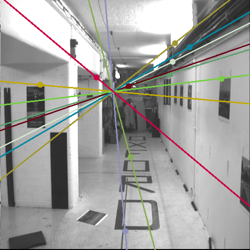

# Epipolar Geometry Estimation: Fundamental Matrix, Eight Point Algorithm, and RANSAC

The **Fundamental Matrix** encapsulates the geometric relationship between corresponding points in stereo images, providing essential information for rectification, stereo reconstruction, and 3D scene understanding.

The **Eight-Point Algorithm** is a robust method for estimating the Fundamental Matrix from point correspondences between stereo image pairs.
With the complements of **RANSAC**, Eight Point Algorithm can effectively find the best fundamental matrix estimation to fit relate the stereo data keypoints.

## Results

<table>
    <thead>
        <tr>
            <th></th>
            <th>Left Image</th>
            <th>Right Image</th>
        </tr>
    </thead>
    <tbody>
        <tr>
            <th>Original</th>
            <td rowspan=1>
                
            </td>
            <td rowspan=1>
                
            </td>
        </tr>
        <tr>
            <th>Key Points</th>
            <td rowspan=1>
                
            </td>
            <td rowspan=1>
                
            </td>
        </tr>
        <tr>
            <th>Epipolar Line</th>
            <td rowspan=1>
                
            </td>
            <td rowspan=1>
                
            </td>
        </tr>
        <tr>
            <th>RANSAC Epipolar Line</th>
            <td rowspan=1>
                
            </td>
            <td rowspan=1>
                
            </td>
        </tr>
    </tbody>
</table>

## Usage

The main code is in [eight_point_algorithm.ipynb](./eight_point_algorithm.ipynb)

## Dependencies

The project uses `python==3.12.2`, and the dependencies can be installed by running:

```
pip install -r requirements.txt
```
